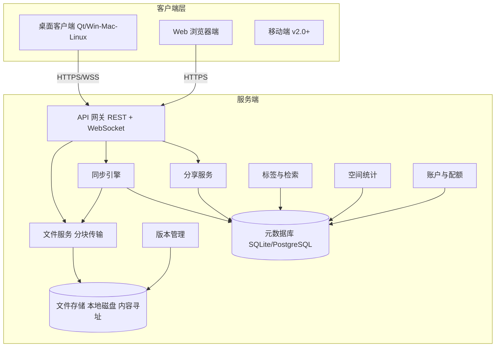
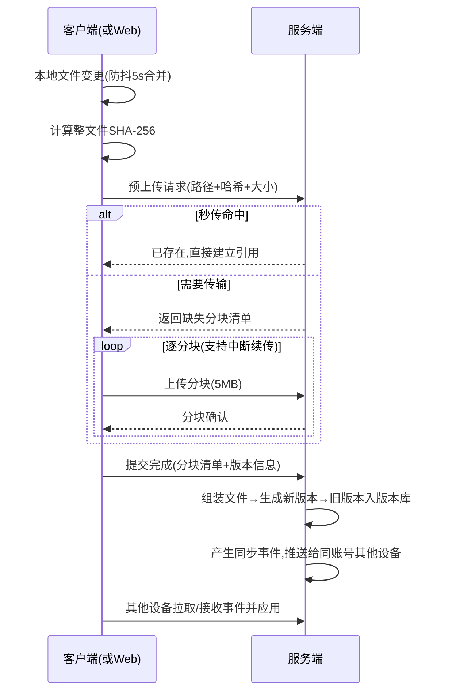
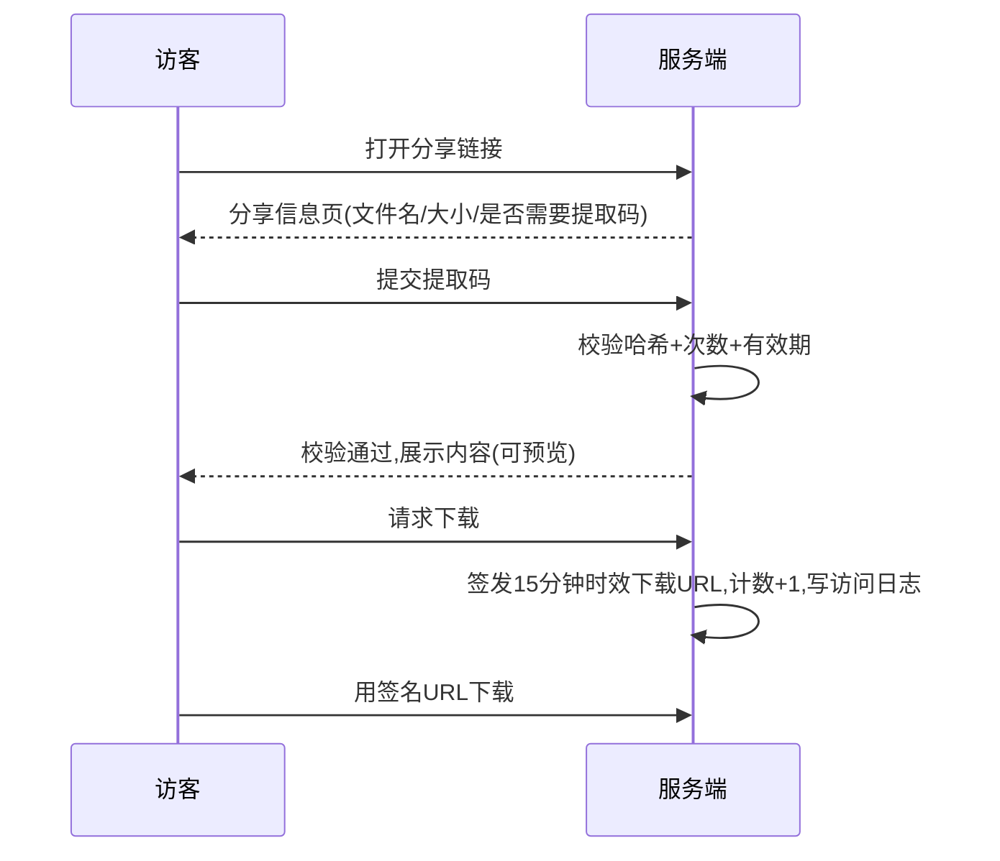

# PRD：个人私有云网盘系统（暂定名：云匣 CloudVault）

| 项目 | 内容 |
|---|---|
| 产品名称 | 云匣 CloudVault（暂定名，可替换） |
| 文档版本 | v0.1 |
| 文档状态 | 草案（待评审） |
| 撰写日期 | 2026-09-04 |
| 目标读者 | 产品、开发、测试、部署维护者 |
| 关联工程 | 本仓库 Qt 工程（File.pro，桌面客户端雏形） |

## 修订记录

| 版本 | 日期 | 修订人 | 说明 |
|---|---|---|---|
| v0.1 | 2026-09-04 | — | 初稿：完整功能定义、流程、数据模型与版本规划 |

---

## 1. 产品概述

### 1.1 背景与问题

私有云网盘要解决的核心矛盾是：**数据主权与使用便利不可兼得**。目前主流方案各有硬伤：

| 现有方案 | 痛点 |
|---|---|
| 公有云网盘（百度网盘等） | 非会员严重限速；长期订阅费用；文件存于他人服务器，存在隐私、审查、服务关停风险 |
| 成熟开源私有云（Nextcloud） | 功能臃肿、部署依赖复杂（PHP + 多组件）、对小体量用户过重、同步与版本能力一般 |
| 专业同步盘（Seafile / Syncthing） | Seafile 社区版功能受限；Syncthing 无中心网页盘、分享与统计能力弱 |
| 商用 NAS（群晖/威联通） | 硬件门槛高（2000 元以上）、系统学习成本高 |

同时，多设备文件流转普遍依赖微信传文件 / U 盘 / 邮箱，带来版本混乱、误删无法找回、找文件靠翻聊天记录等次生问题。

**结论**：市场缺少一款"部署轻、同步稳、可分享、能检索、数据 100% 自有"的个人级私有云盘。

### 1.2 产品定位

> 一句话定位：**部署在自己设备上的轻量私有云盘 —— 数据自己存、同步自动做、分享可控、找文件快。**

定位边界（重要，防止范围膨胀）：

- **不对标**百度网盘、阿里云盘等公有云大厂：不做海量用户运营、不做离线下载/资源生态、不做会员与广告体系。
- **目标规模**：单实例 1~20 个用户；文件量 10 万级以内；存储容量取决于自有硬盘（建议 ≤10TB）。
- **部署形态**：软件产品，可跑在闲置 PC、迷你主机、已有 NAS、云服务器（自购 VPS）上。

### 1.3 目标用户

**画像 A —— 隐私敏感的个人用户「小陈」**
- 身份：程序员 / 自媒体作者，3 台设备（台式机、笔记本、手机）。
- 行为：个人文档、照片、代码、素材存网盘；担心隐私与限速。
- 诉求：家里挂一台设备当私有云，各设备自动同步；偶尔给朋友发个带密码的文件链接。

**画像 B —— 小型工作室「三页设计工作室」**
- 身份：4~8 人设计/翻译/摄影团队，无专职 IT。
- 行为：项目文件频繁更新、多轮修改；需要给客户交付文件；素材体积大。
- 诉求：团队文件有一处统一存放且自动同步；客户通过带密码链接下载；误覆盖能找回历史版本；知道空间都被什么占了。

**画像 C —— 家庭 / 极客用户「老王」（延伸用户）**
- 身份：有一定动手能力的家庭用户，已有闲置主机或 NAS。
- 诉求：全家人照片视频集中备份，手机自动备份，按人分配空间配额。

### 1.4 核心价值主张

| 痛点 | 本产品的回答 |
|---|---|
| 限速、慢 | 局域网内跑满带宽（千兆网 ≥80MB/s）；外网速度取决于自家宽带，无人为限速 |
| 订阅收费 | 一次部署，长期免费，无会员体系 |
| 数据不受控 | 文件全部落在自己的硬盘上，服务关停=把文件夹拷走即可 |
| 多设备同步麻烦 | 客户端挂后台自动双向同步，改动秒级感知 |
| 误删 / 误覆盖 | 自动版本快照 + 回收站，双保险可回溯 |
| 分享不可控 | 带提取码的链接，可设有效期、次数限制，随时吊销，留访问日志 |
| 文件找不到 | 标签体系 + 名称/拼音搜索，多条件组合筛选 |
| 空间糊涂账 | 用量总览、分类统计、大文件排行、清理建议 |

---

## 2. 竞品参考（生态定位，不构成对标）

| 产品 | 优势 | 劣势 | 对本产品的启示 |
|---|---|---|---|
| Nextcloud | 功能生态极全（日历/协作/插件） | 部署重、PHP 技术栈、同步与版本体验一般 | 证明私有云需求真实存在；我们要做"轻量同步优先"的差异化 |
| Seafile | 同步引擎成熟、性能好 | 社区版砍功能、中文文档一般 | 同步是第一卖点，必须做到可靠 |
| Syncthing | P2P 无中心、开源免费 | 无网页盘、无分享/统计/标签 | 补齐"网页访问 + 分享 + 检索"即形成差异化 |
| 群晖 DSM | 体验成熟（Drive、快照） | 硬件绑定、价格高 | 版本快照策略（类 Hyper Backup）值得借鉴 |
| 百度网盘 | 资源生态、海量用户 | 限速、收费、隐私 | **明确不对标**；只借鉴"分享链接"这一交互形式 |

---

## 3. 用户场景故事

**场景 1：换电脑不搬家（触达 F2/F3）**
小陈买了新笔记本，安装客户端并登录后，选择同步"工作文档"目录。历史文件在后台静默下载，1 小时后目录与台式机完全一致。此后他在任一设备改文件，另一台 10 秒内收到变更。

**场景 2：客户交付与返稿（触达 F5/F6）**
工作室把"品牌 VI 第三稿"文件夹生成一个带提取码、7 天有效、限 20 次下载的链接发给客户。客户下载了 3 次；项目结束当天，工作室在"分享管理"里一键吊销。全流程无需注册账号。

**场景 3：误覆盖的自救（触达 F4）**
设计师小林误把旧版 PPT 覆盖保存并已同步。她在网页端右键该文件 →"历史版本"，看到昨天 18:02 的版本，点击恢复。恢复动作本身生成一个新版本，当前文件回到昨天的内容，且没有任何历史丢失。

**场景 4：年度空间大扫除（触达 F7）**
年底老王发现硬盘 90% 满。打开"空间统计"：视频占 62%、Top20 大文件里有 8 个是重复下载的录像；按建议清空回收站并清理 30 天前的旧版本，释放 300GB。

---

## 4. 产品目标与成功指标

### 4.1 产品目标

- **G1 稳定可靠**：同步是生命线，任何异常不允许造成用户数据丢失。
- **G2 高效检索**：文件多了以后"找得到"是留存关键。
- **G3 安全可控**：暴露到公网也不出安全事故。
- **G4 部署简单**：非专业用户 30 分钟内完成部署并开始同步。

### 4.2 成功指标（可验收）

| 指标 | 目标值 |
|---|---|
| 同步最终一致成功率（24h 内） | ≥ 99.9% |
| 同步冲突产生率 | ≤ 0.1%（且冲突永不丢数据） |
| 局域网上传速度（千兆网） | ≥ 80 MB/s |
| 断点续传 | 任意中断后可从已传分块继续，不重传已完成分块 |
| 检索响应时间（10 万文件） | ≤ 500 ms |
| 版本恢复操作耗时 | ≤ 2 s（不含内容传输） |
| 部署时间（Docker） | ≤ 30 分钟 |
| 数据丢失事故 | 0 容忍 |

---

## 5. 功能需求

### 5.1 功能架构总览

### 5.2 优先级定义

- **P0**：MVP 必须（没有则产品不成立）
- **P1**：V1.0 正式版必须
- **P2**：V1.1+ / 可选项

### 5.3 F1 账户与设备管理

| 编号 | 需求 | 描述 | 优先级 |
|---|---|---|---|
| FR-1-1 | 用户管理 | 管理员在后台创建/禁用用户，**无开放注册**（个人产品，安全第一） | P0 |
| FR-1-2 | 登录认证 | 用户名+密码登录，签发会话 Token；支持"记住此设备" | P0 |
| FR-1-3 | 设备绑定 | 每个登录端生成设备记录（名称/系统/最后在线）；可远程踢下线 | P0 |
| FR-1-4 | 空间配额 | 管理员为每个用户设置配额（默认不限或整盘共享） | P1 |
| FR-1-5 | 两步验证 | TOTP 动态口令 | P2 |

**验收标准（AC）**
- 同一账号多设备同时在线互不干扰；踢下线后该设备 30s 内停止一切传输。
- 连续 5 次密码错误锁定该 IP 10 分钟。

### 5.4 F2 文件上传下载

| 编号 | 需求 | 描述 | 优先级 |
|---|---|---|---|
| FR-2-1 | 基础上传 | Web 端与客户端均支持上传文件/整个文件夹（保留目录结构） | P0 |
| FR-2-2 | 分块上传 | 文件按 5MB 分块并行上传；单文件大小上限默认 100GB | P0 |
| FR-2-3 | 断点续传 | 传输中断（网络/重启）后从已完成的分块继续，不重传 | P0 |
| FR-2-4 | 秒传/去重 | 上传前计算 SHA-256，服务端已存在相同内容则直接引用，0 流量 | P0 |
| FR-2-5 | 下载 | 支持单文件、多选打包 zip、整文件夹下载；打包异步生成并通知 | P0 |
| FR-2-6 | 传输队列 | 统一队列展示进度/速度，支持暂停、恢复、取消、失败自动重试（3 次） | P0 |
| FR-2-7 | 冲突策略 | 目标已有同名文件时：跳过 / 自动重命名 / 覆盖（同步引擎另见 F3） | P0 |

**验收标准（AC）**
- 上传 10GB 文件中途拔网线，恢复后继续传输且最终文件哈希一致。
- 同内容文件第二次上传耗时 < 1s（秒传命中）。
- 全程速度显示、剩余时间估算误差可接受。

### 5.5 F3 文件夹自动同步（核心模块）

同步模型：**中心式同步**（客户端 ↔ 服务端），客户端本地目录与云端目录建立"同步对"。

| 编号 | 需求 | 描述 | 优先级 |
|---|---|---|---|
| FR-3-1 | 实时监听 | 监听本地文件系统事件（创建/修改/删除/重命名），5 秒防抖合并后上传；每 10 分钟及启动时做一次全量对账兜底 | P0 |
| FR-3-2 | 同步方向 | 每个同步对可配置：双向同步 / 仅上传（本地备份到云）/ 仅下载（云发布到本地） | P0 |
| FR-3-3 | 增量同步 | 修改的文件只上传变化的内容块，非整文件重传 | P1 |
| FR-3-4 | 忽略规则 | 默认忽略 `Thumbs.db`、`.DS_Store`、`*.tmp`、`~$*`、系统休眠文件；支持每目录 `.cvignore` 文件（gitignore 语法子集） | P0 |
| FR-3-5 | 冲突处理 | 双端同时修改：保留较新者为主文件，较旧者另存为 `文件名(冲突-设备名-时间).ext`，**绝不静默覆盖** | P0 |
| FR-3-6 | 删除同步 | 一端删除 → 云端与另一端同步删除（进回收站，见 F8）；可配置"仅解除同步不删除本地" | P0 |
| FR-3-7 | 选择性同步 | 云端目录树勾选，未勾选目录仅在云端保留不落地本地 | P1 |
| FR-3-8 | 同步状态可视化 | 资源管理器图标角标：✓ 已同步 / ⟳ 同步中 / ⚠ 冲突或错误；托盘显示整体状态 | P0 |
| FR-3-9 | 同步日志 | 每次同步对账可查看：上传/下载/跳过/冲突清单 | P1 |

**关键规则表：冲突与异常场景处理**

| 场景 | 处理 |
|---|---|
| 双端同时修改同一文件 | 新者为主，旧者存冲突副本 |
| 一端修改、另一端删除 | 修改优先：被删端恢复该文件，并提示用户 |
| 文件名仅大小写差异（跨平台） | 视为冲突，生成重命名副本 |
| 传输中断 | 分块续传，最终以完整哈希校验 |
| 时钟偏差 | 以服务端接收时间为准 |

**验收标准（AC）**
- 两台设备离线各自修改同一文件，恢复联网后：两份内容都存在（一主一副本），零数据丢失。
- 1000 个文件批量复制进同步目录，5 秒防抖后一次性入队，全部最终同步成功。
- 修改 10GB 视频的 1MB 片段，仅上传变化块（P1 验证增量生效）。

### 5.6 F4 版本回溯

| 编号 | 需求 | 描述 | 优先级 |
|---|---|---|---|
| FR-4-1 | 自动版本快照 | 文件每次被修改并同步成功，即生成一个历史版本；纯重命名不产生新版本 | P0 |
| FR-4-2 | 版本保留策略 | 默认：每文件最多保留 **10 个历史版本**，且历史版本距今天 **≤ 90 天**（双限取先到者）；策略可在设置中调整 | P0 |
| FR-4-3 | 版本列表 | 网页/客户端可查看某文件的版本时间线：版本时间、大小、来源设备 | P0 |
| FR-4-4 | 恢复版本 | 一键恢复到指定版本；**恢复动作本身生成新版本**，任何历史不丢失 | P0 |
| FR-4-5 | 下载历史版本 | 可单独下载某一历史版本 | P1 |
| FR-4-6 | 版本占用统计与清理 | 版本占用计入用户配额并在空间统计中单列；支持按文件/全库清理旧版本 | P1 |

**验收标准（AC）**
- 同一文件连续修改 15 次，版本库仅保留符合策略的 10 个，且最近一次修改必然可回溯。
- 恢复到 V3 后再恢复到 V5（当前），两个动作全程无损。

### 5.7 F5 带密码分享链接

| 编号 | 需求 | 描述 | 优先级 |
|---|---|---|---|
| FR-5-1 | 创建分享 | 对文件/文件夹生成外部链接；有效期：1 天 / 7 天 / 30 天 / 永久 | P0 |
| FR-5-2 | 提取码 | 4~8 位，默认随机生成，可自定义或留空（留空需二次确认） | P0 |
| FR-5-3 | 下载次数限制 | 可选设上限（如 20 次），到达后自动失效 | P0 |
| FR-5-4 | 随时吊销 | 分享管理页一键失效，立即生效 | P0 |
| FR-5-5 | 访客页面 | 无需登录的只读页面：展示文件名/大小/预览（图片、文本、音视频流媒体 P1），输入提取码后可下载 | P0 |
| FR-5-6 | 分享管理 | "我创建的分享"列表：对象、状态、有效期、已下载次数；支持批量吊销 | P0 |
| FR-5-7 | 访问日志 | 记录每次访问/下载：时间、IP、行为；可在分享详情中查看 | P1 |
| FR-5-8 | 分享文件夹浏览 | 访客可浏览文件夹层级并选择性下载（支持打包 zip） | P1 |

**安全规则**
- 提取码服务端只存哈希；连续输错 5 次锁定该链接 10 分钟。
- 分享链接的下载走独立签名 URL（时效 15 分钟），避免暴露存储路径。
- 文件被删除/移动后，其分享链接自动失效。

**验收标准（AC）**
- 创建 → 发给无账号的外部用户 → 输码下载全流程 ≤ 1 分钟。
- 吊销后原链接立即返回"已失效"；过期链接同样如此。

### 5.8 F6 标签与检索

| 编号 | 需求 | 描述 | 优先级 |
|---|---|---|---|
| FR-6-1 | 手动标签 | 用户自定义标签（名称 + 颜色），一个文件可打多个标签；支持给标签重命名、合并、删除 | P0 |
| FR-6-2 | 类型自动标签 | 按文件类型自动归类视图：文档 / 图片 / 视频 / 音频 / 压缩包 / 安装包 | P0 |
| FR-6-3 | 名称搜索 | 文件名子串匹配；支持拼音首字母（如输入 "bg" 命中 "报告.docx"） | P1 |
| FR-6-4 | 组合筛选 | 标签 × 类型 × 时间范围 × 大小范围 组合过滤，结果可按名称/时间/大小排序 | P0 |
| FR-6-5 | 最近文件 / 星标收藏 | 首页快捷入口 | P0 |
| FR-6-6 | 全文检索 | 对文本/Office/PDF 建内容索引（可选开关，索引耗时可接受） | P2 |
| FR-6-7 | 标签批量操作 | 搜索结果多选 → 批量打标签/移动/下载 | P1 |

**验收标准（AC）**
- 10 万文件库中按名称搜索响应 ≤ 500ms。
- 搜索 + 标签 + 时间三条件组合结果准确。

### 5.9 F7 空间统计

| 编号 | 需求 | 描述 | 优先级 |
|---|---|---|---|
| FR-7-1 | 用量总览 | 已用/总容量进度环、文件总数、版本占用、回收站占用 分项展示 | P0 |
| FR-7-2 | 分类统计 | 按文件类型的容量占比图（饼图/条形） | P0 |
| FR-7-3 | 大文件排行 | Top 20 大文件列表，支持直接跳转/删除 | P0 |
| FR-7-4 | 增长趋势 | 近 30/90 天空间增长曲线 | P1 |
| FR-7-5 | 清理建议 | 一键定位：回收站、超期旧版本、（P2）疑似重复文件；支持按建议一键清理 | P1 |
| FR-7-6 | 配额告警 | 用量 ≥80% 提醒；≥95% 阻止新上传并明确提示原因 | P0 |

### 5.10 F8 回收站

| 编号 | 需求 | 描述 | 优先级 |
|---|---|---|---|
| FR-8-1 | 删除入站 | 任何删除（含同步删除）先进回收站，保留 30 天 | P0 |
| FR-8-2 | 还原 | 支持单选/多选还原到原位置（原位置不存在则自动创建） | P0 |
| FR-8-3 | 彻底删除 | 手动彻底删除；到期自动清理 | P0 |
| FR-8-4 | 管理员清理 | 管理员可按用户/时间批量清理回收站 | P1 |

### 5.11 F9 多端入口

| 编号 | 需求 | 描述 | 优先级 |
|---|---|---|---|
| FR-9-1 | Web 端 | 浏览器完成：文件浏览/上传下载/分享/版本/标签/统计/回收站 全功能 | P0 |
| FR-9-2 | 桌面客户端 | Windows / macOS / Linux：后台同步引擎 + 托盘 + 简化文件视图 + 传输队列 | P0 |
| FR-9-3 | 手机自动备份 | 移动端照片/视频自动备份 | P2 |
| FR-9-4 | WebDAV 接口 | 供第三方播放器/OBS/挂载盘接入 | P2 |

### 5.12 F10 系统管理与安全

| 编号 | 需求 | 描述 | 优先级 |
|---|---|---|---|
| FR-10-1 | 管理后台 | 用户管理、存储路径配置、全局参数（版本策略/回收站天数） | P0 |
| FR-10-2 | 操作审计日志 | 登录、删除、分享创建/吊销、配置变更留痕（保留 ≥180 天） | P1 |
| FR-10-3 | 传输加密 | 强制 HTTPS；提供自签证书与 Let's Encrypt 两种配置指引 | P0 |
| FR-10-4 | 登录防护 | 密码强度策略、失败锁定、会话超时 | P0 |
| FR-10-5 | 静态加密 | 落盘文件加密存储（可选开关） | P2 |
| FR-10-6 | 数据备份 | 元数据库一键备份/恢复指引；文件区本身就是普通目录，可直接整盘备份 | P1 |
| FR-10-7 | 系统健康 | 磁盘剩余空间监控告警、服务运行日志 | P1 |

---

## 6. 非功能需求

| 维度 | 要求 |
|---|---|
| 性能 | 千兆局域网吞吐 ≥80MB/s；万兆环境可跑满；100 并发连接下 API P95 < 300ms |
| 容量 | 单实例支持 ≤10TB 存储、≤10 万文件、≤20 用户无明显性能退化 |
| 可靠性 | 服务异常重启后自动恢复，进行中的分块传输可续传；元数据与文件操作保证一致性（先写文件、后提交元数据） |
| 安全 | 全链路 TLS；提取码/密码仅存哈希（bcrypt/argon2）；分享走时效签名 URL；防路径穿越、防越权访问（渗透测试用例见验收） |
| 兼容性 | 服务端：Windows / Linux / macOS（x86_64、ARM64）；客户端：Win10+、macOS 12+、主流 Linux；浏览器：Chrome/Edge/Safari/Firefox 最近两个大版本 |
| 易用性 | Docker Compose 一键部署；非技术用户按向导 30 分钟完成"部署→建账号→开始同步" |
| 可维护性 | 结构化日志；关键指标（同步队列长度、错误率）暴露给简单监控页 |
| 中文本地化 | 全中文界面与文档；时间、容量单位符合中文习惯 |

---

## 7. 关键流程设计

### 7.1 文件同步上传流程

### 7.2 分享访问流程

### 7.3 版本回溯流程

1. 用户在文件详情打开"历史版本"时间线；
2. 选择目标版本 → 预览（P1）或直接恢复；
3. 服务端将目标版本内容设为当前内容，并**将恢复前的状态另存为新版本**；
4. 版本变更作为同步事件下发，各设备更新本地文件。

---

## 8. 数据模型（核心实体）

| 实体 | 关键字段 | 说明 |
|---|---|---|
| User | id, username, password_hash, role(admin/user), quota_bytes, status, created_at | 角色区分管理员与普通用户 |
| Device | id, user_id, name, os, last_seen_at, status | 设备绑定与踢下线 |
| FileNode | id, parent_id, owner_id, name, is_dir, size, content_hash, mtime, ref_count, status | 目录树节点；软删除标记；ref_count 支持内容去重引用 |
| Chunk | id, hash(SHA-256), size, ref_count, storage_path | 内容寻址分块，去重存储 |
| FileVersion | id, file_id, version_no, size, content_ref, device_id, created_at | 版本快照；content_ref 指向分块清单 |
| SyncPair | id, device_id, remote_path, local_path, direction(two-way/upload-only/download-only) | 客户端同步对配置 |
| ShareLink | id, owner_id, file_id, code_hash, expires_at, max_downloads, download_count, status, created_at | 分享链接；status=active/revoked/expired |
| ShareAccessLog | id, share_id, action(open/verify/download), ip, ua, created_at | 分享访问日志 |
| Tag | id, owner_id, name, color | 用户标签 |
| FileTag | file_id, tag_id | 多对多 |
| OperationLog | id, user_id, action, target, detail, created_at | 审计日志 |

> 存储布局建议：`/data/files/<hash前2位>/<hash>` 存内容块；`/data/meta/` 存元数据库；`/data/trash/` 回收站逻辑态（靠元数据标记，不物理搬移）。

---

## 9. 技术架构建议

### 9.1 总体选型

| 层 | 推荐 | 备选 | 理由 |
|---|---|---|---|
| 服务端 | **Go**（单二进制，跨平台，高并发，部署零依赖） | Node.js(NestJS) / Rust | 个人产品重部署体验，Go 单文件 + Docker 最省心 |
| 元数据库 | **SQLite**（默认） | PostgreSQL（≥20 用户或高并发时） | 单机场景 SQLite 足够，备份=拷一个文件 |
| 桌面客户端 | **Qt 6（C++/QML）**，与本仓库现有 Qt 工程衔接 | Electron / Tauri | 已有 Qt 基础；原生性能好，文件系统监听与传输稳定 |
| Web 前端 | Vue 3 + Vite（或 React） | — | 组件生态成熟，中文资料多 |
| 通信 | REST + WebSocket（同步事件推送） | gRPC（内部） | 简单通用，浏览器友好 |
| 部署 | Docker Compose 一键；同时提供 Windows 服务安装包 | 裸机二进制 | 覆盖"极客 NAS"与"Windows 闲置机"两类人群 |

### 9.2 关键技术点

- **内容寻址存储**：文件按 SHA-256 分块存储，天然获得去重（秒传）与增量同步能力。
- **一致性顺序**：先落盘内容 → 再提交元数据 → 最后广播事件；崩溃重启后通过对账任务修复悬挂状态。
- **同步对账**：客户端启动与每 10 分钟做一次"本地清单 vs 云端清单"diff，修正实时监听可能漏掉的事件（如断电期间的变化）。
- **文件监听**：Qt 端用 `QFileSystemWatcher` + 平台原生 API（Windows ReadDirectoryChangesW / macOS FSEvents / Linux inotify）双保险，注意监听句柄数量上限的目录树拆分。
- **外网访问指引**：文档提供 DDNS、frp、Tailscale/ZeroTier 三种方案教程；产品本身不强绑内网穿透。

### 9.3 最低硬件建议

| 项 | 最低 | 推荐 |
|---|---|---|
| CPU | 双核 | 4 核 |
| 内存 | 2GB | 4GB+ |
| 磁盘 | 自备容量即可 | 独立数据盘 + 定期外接备份 |
| 网络 | 局域网即可用 | 有公网 IP 或穿透方案 |

---

## 10. 页面清单与 UI 结构

**Web 端**
1. 登录页
2. 文件库（列表/网格视图、面包屑、右键菜单：下载/分享/标签/历史版本/删除）
3. 文件详情抽屉（预览、标签、版本时间线、活动记录）
4. 分享管理页
5. 回收站
6. 空间统计页
7. 管理后台（用户、参数、日志、健康）
8. 访客分享页（免登录）

**桌面客户端**
1. 托盘图标 + 快捷菜单（同步状态、暂停/恢复、打开本地目录、打开网页端）
2. 同步对管理（添加/编辑同步对、方向、忽略规则）
3. 传输队列窗口
4. 设置（账号、开机自启、带宽限制、代理）

**移动端（V2.0+）**：文件浏览、相册自动备份、分享管理。

---

## 11. 版本规划路线图

| 版本 | 周期（参考） | 范围 | 出口标准 |
|---|---|---|---|
| **V0.5 MVP** | 8 周 | F1 基础账户、F2 上传下载（分块/续传/秒传）、F3 双向同步基础版+冲突副本、F8 回收站、Web 文件库 | 两设备互同步稳定跑 2 周 0 丢数据 |
| **V1.0 正式版** | +6 周 | F4 版本回溯、F5 密码分享、F6 标签+组合筛选、F7 空间统计、桌面客户端（托盘+队列）、HTTPS、配额告警 | 完成验收 AC 全部 P0/P1；公网部署安全自查通过 |
| **V1.1** | +6 周 | 增量块同步、选择性同步、拼音搜索、分享文件夹浏览、访问日志、统计趋势、清理建议、审计日志 | — |
| **V2.0+** | 规划中 | 移动端+相册备份、WebDAV、全文检索、静态加密、疑似重复检测、TOTP | — |

---

## 12. 风险与应对

| 风险 | 等级 | 应对 |
|---|---|---|
| 同步引擎 bug 导致数据丢失 | 高 | 冲突永不覆盖只存副本；删除全进回收站；版本快照兜底；MVP 期长时间灰度 |
| 用户将服务暴露公网引入安全风险 | 高 | 默认强密码策略+登录锁定；HTTPS 指引；分享隔离与签名 URL；审计日志 |
| 外网访问体验受家庭宽带限制（无公网 IP） | 中 | 文档化 Tailscale/frp 方案；明确产品边界（不对标公网服务） |
| 工程量失控 | 中 | 严格按路线图裁剪；P2 功能全部有开关或后置；先保同步核心质量 |
| 跨平台文件系统差异（大小写、特殊字符、长路径） | 中 | 建立跨平台文件名规范化规则与测试用例集 |
| 单盘无冗余硬件损坏 | 中 | 首页常驻"备份提醒"；支持数据目录整体拷贝备份（P1 出备份向导） |

---

## 13. 待确认问题（Open Questions）

1. 服务端技术栈最终定 Go 还是 Node？（影响招聘与后续生态）
2. V1.0 是否必须包含移动端照片备份？（影响版本周期 ±4 周）
3. WebDAV 优先级是否提前？（接入 OBS/播放器/挂载盘的需求是否高频）
4. 是否需要支持一台服务端多磁盘池化（span/raid 由文件系统负责还是产品层负责）？
5. 产品名"云匣"是否确认，还是沿用工程名？

---

## 14. 附录：术语表

| 术语 | 定义 |
|---|---|
| 同步对 | 客户端本地目录与云端目录之间的一条同步关系及其方向配置 |
| 秒传 | 上传前按内容哈希匹配服务端已有文件，直接建立引用而不传输内容 |
| 内容寻址 | 以内容哈希作为存储键的存储方式，天然支持去重 |
| 冲突副本 | 双端同时修改同一文件时，为落败版本生成的带标记副本文件 |
| 版本快照 | 文件被修改同步成功时自动保留的历史内容副本 |
| 提取码 | 分享链接的访问密码 |
| 对账 | 客户端与服务端周期性比对文件清单以修复遗漏变更的机制 |
| MVP | 最小可行产品（Minimum Viable Product） |

---

*本文档为 v0.1 草案，评审通过后进入 V0.5 MVP 开发。*
